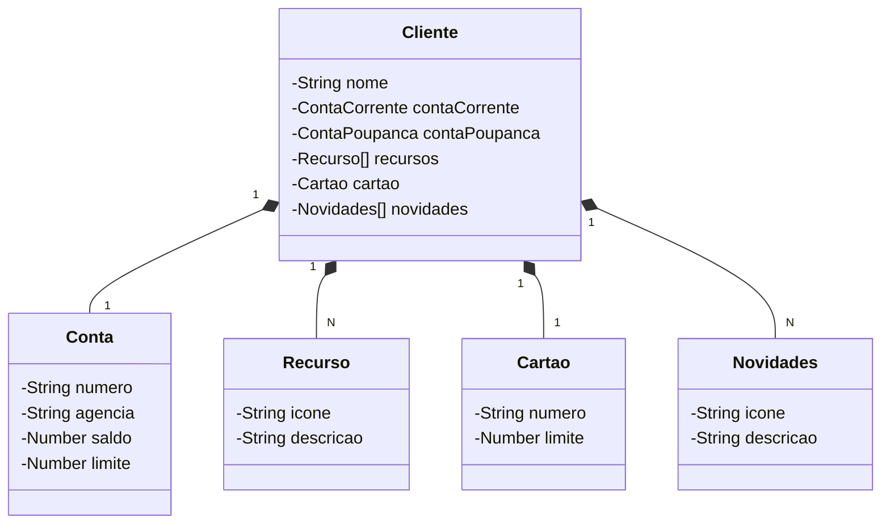

# Api.Bank.Dio
Java RESTful API criada para o bootcamp do Santander em java e angular

## Diagrama de classes

```mermaid
classDiagram
  class Cliente {
    -String nome
    -ContaCorrente contaCorrente
    -ContaPoupanca contaPoupanca
    -Recurso[] recursos
    -Cartao cartao
    -Novidades[] novidades
  }

  class Conta {
    -String numero
    -String agencia
    -Number saldo
    -Number limite
  }

  class Recurso {
    -String icone
    -String descricao
  }

  class Cartao {
    -String numero
    -Number limite
  }

  class Novidades {
    -String icone
    -String descricao
  }

  Cliente "1" *-- "1" Conta
  Cliente "1" *-- "N" Recurso
  Cliente "1" *-- "1" Cartao
  Cliente "1" *-- "N" Novidades
```
